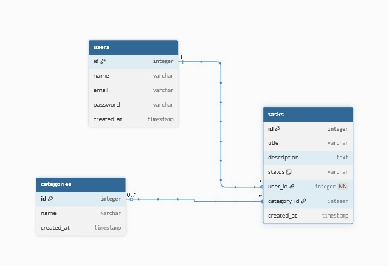

# 📝 Task Manager Laravel

## Description

Task Manager est une application web développée avec Laravel permettant à chaque utilisateur connecté de gérer ses tâches personnelles.

Chaque utilisateur dispose de son propre espace sécurisé où il peut :

* Créer des tâches
* Modifier ses tâches
* Supprimer ses tâches
* Filtrer ses tâches par statut et catégorie

---

## Contexte du projet

Une startup locale souhaite un outil simple pour permettre à ses employés de gérer leurs tâches quotidiennes.

Objectif :
Créer un MVP (Minimum Viable Product) fonctionnel, sécurisé et respectant les bonnes pratiques Laravel.

---

## Technologies utilisées

* Laravel
* PHP
* MySQL / MariaDB
* Blade (templating)
* Eloquent ORM

---

## Fonctionnalités principales

### Authentification

* Inscription (nom, email, mot de passe)
* Connexion / Déconnexion

###  Gestion des tâches

* Liste des tâches personnelles
* Création de tâche
* Modification de tâche
* Suppression avec confirmation
* Changement rapide du statut

###  Filtrage

* Filtrer par statut (à faire, en cours, terminé)
* Filtrer par catégorie

---
### Diagramme MLD

## Architecture & Concepts Laravel

* Routes protégées avec middleware `auth`
* Relations Eloquent :

  * User → hasMany Tasks
  * Task → belongsTo User
  * Task → belongsTo Category
* Blade :

  * `@extends`, `@section`
  * `@foreach`, `@if`, `@auth`
* Migrations & Seeders

---

## Sécurité

* Vérification que l'utilisateur est propriétaire de la tâche avant modification ou suppression
* Isolation des données (chaque utilisateur voit uniquement ses tâches)

---

## Debugging

### Laravel Debugbar

* Analyse des requêtes SQL
* Détection des problèmes de performance (N+1)

### Laravel Telescope

* Accessible via `/telescope`
* Analyse des requêtes HTTP, erreurs et logs

---

## User Stories

### Authentification

* US1 : Inscription utilisateur
* US2 : Connexion / Déconnexion

### Gestion des tâches

* US3 : Voir toutes mes tâches
* US4 : Créer une tâche
* US5 : Modifier une tâche
* US6 : Supprimer une tâche
* US7 : Changer le statut rapidement

### Filtrage

* US8 : Filtrer par statut
* US9 : Filtrer par catégorie

---

## Installation

```bash
git clone <repo_url>
cd task-manager

composer install
cp .env.example .env
php artisan key:generate

# Configurer la base de données dans .env

php artisan migrate --seed
php artisan serve
```

---

##  Accès

* Application : http://127.0.0.1:8000
* Telescope : http://127.0.0.1:8000/telescope

---

